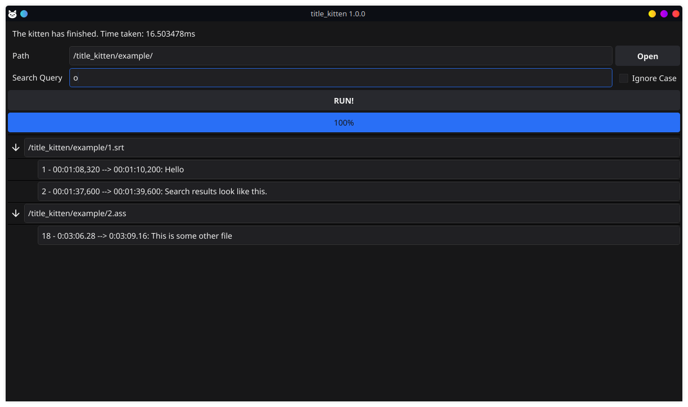

# title_kitten

*title_kitten* is a subtitle search program written in Go. It allows you
to search for a string of text in a folder of subtitle files.



Supported filetypes:

- .srt

- .ass / .ssa


## Installation

You can download compiled Windows and Linux binaries at the releases tab:  
https://github.com/Dmitry-Fofanov/title_kitten/releases/

To install and run *title_kitten* from source, follow these steps:

1. Make sure you have Go installed on your machine. You can download it from the
   official Go website: https://golang.org/

2. Clone the title_kitten repository to your local machine:

   ```
   git clone https://github.com/Dmitry-Fofanov/title_kitten.git
   ```

3. Change into the title_kitten directory:

   ```
   cd title_kitten
   ```

4. Download the project dependencies:

   ```
   go mod download
   ```

5. Build the program using the following command:

   ```
   go build
   ```

   This will create a binary for your system.

6. Run the program:

   ```
   ./title_kitten
   ```

## Usage

To use *title_kitten*, follow these steps:

1. Open the program.

2. Enter the folder path where your subtitle files are located.

3. Enter the search string you want to find in the subtitle files.

4. Optionally check the "Ignore Case".

5. Click on the "RUN!" button.

6. The program will display the list of subtitle files and their lines that
   contain the search string.

## License

*title_kitten* is released under the [Zero-Clause BSD license](https://opensource.org/license/0bsd/).
